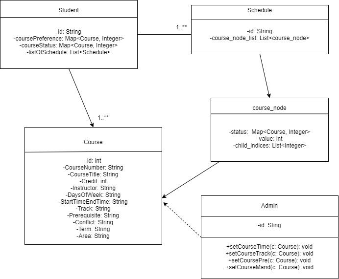

# 2020-spring-group-JayPath

This application has been deployed online: https://master.d2w70sft0n5zlh.amplifyapp.com/

# Requirement Specification Document

## Problem Statement

> Write a few sentences that describes the problem you are trying to solve. In other words, justify why this software project is needed.

Choosing what courses to take for a coming semester and not knowing how to plan ahead for successful graduation can be stressful. The problem is further complicated by all kinds of restrictions on course scheduling, including considering different prerequisites and spring/fall offerings. Students need a personalized course planning system recommending which courses to take each semester that is tailored to his/her academic interests.

## Potential Clients
> Who are affected by this problem (and would benefit from the proposed solution)? I.e. the potential users of the software you are going to build.

Undergraduate students at Johns Hopkins University or newly enrolled students who are planning on completing a bachelor degree in computer science and want to explore various academic interests.

## Proposed Solution
> Write a few sentences that describes how a software solution will solve the problem described above.

A web-based application will be used to solve this problem. Our application takes inputs from users (e.g., major, year of study, courses already taken, areas of focus, expected graduation year) and aligns with the university’s graduation requirement and course offerings and information, and then it will use our built-in intelligence algorithm to find course schedules that fit best to the user's need and display each through a calendar view.

## Functional Requirements
> List the (functional) requirements that software needs to have in order to solve the problem stated above. It is useful to write the requirements in form of **User Stories** and group them into those that are essential (must have), and those which are non-essential (but nice to have).

### Must have
As a CS student, I want to specify my areas of focus/preference in my major, so that the relevant courses will be prioritized.
As a student, I want to input the courses I have taken so that the application knows my current progress.
As a student, I want to receive a schedule that fits into the school’s spring/fall course offerings, so that the schedule is correct and practical.
As a student, I want to receive a schedule that doesn’t contain time conflicts, so that I can directly use it as my plan.
As a student, I want to see multiple recommended schedules so that I get the flexibility to choose between them.
As a student, I want to view the recommended schedule broken into 8 semesters so that I understand the sequence to be followed.
As a student, I want to get my course recommendations displayed in calendar view to get better/more convenient user experience.
As a student, I want to view schedules planned out for different focus areas, so that I can compare, contrast and re-consider the focus area that fits me the most.
As a student, I want to see my progress in meeting the degree requirements, so that I know my current position in the entire plan.  

### Nice to have
As a student, I want to prioritize schedules with the greatest flexibility, so that I can safely graduate even if unexpected circumstances arise over my last semester.
As a student, I want to prioritize certain courses that I find particularly interesting in my final recommended schedules.
As a student who has taken many relevant courses, I want to get warnings on courses I might have missed inputting, so that my input is more accurate.
As a student, I want to see the degree requirements themselves in this application, so that I can be confident with the plans.
As a student, I want to log in/out of this application, so that I can save the previously input information.
As an admin, I want to monitor major graduation requirements, so that the software can modify schedules accordingly.
As an admin, I want to add/delete courses based on school offerings so that students can obtain correct schedules.  
As a student, I want to open a mode called "multiple major mode" so that I can get my recommendation if I decide to take the multiple major option.  
As a student, when getting course recommendations, I want to be able to rearrange/modify the recommended schedule in the application so that I can customize it based on my own preferences.  
As a student, I want to be able to import and extract course schedules as files so that I can easily share my schedule with my friends.

## Software Architecture
> Will this be a Web/desktop/mobile (all, or some other kind of) application? Would it conform to the Client-Server software architecture?

This will be a web application, and it would conform to the Client-Server software architecture. The client (student) sends his/her background information (major/minor, courses taken, focus areas) through the web interface (front end) to the server and the server sends responses (recommended course plans) to the client (student) based on information stored in the database (graduation requirement, course prerequisites, course availability and course history). 

# OO Design

# Wireframe
The first and second page will remain the same as Iteration 2, where the user is first asked to input the courses he/she has taken.

Once all courses are added, the user clicks on "That's it", which would then redirect him/her to the following pages.

The user clicks on one of the focus areas and is then taken to the final recommendation page. The recommendation page shows a complete 4-year schedule with specific courses to take each semester.

User is given more details on a course once his/her cursor hovers on that course. In the event that there does NOT exist a schedule to allow the user to graduate in 4 years, the user is taken to the following page. 

## Iteration Backlog
- As a student , I want to see multiple recommended schedules so that I can choose one based on my personal preferences. 
- As a student, I want my schedule to contain more courses from my focus area so that I take the most value out of my time in college. 
- As a student, I want to view the application on different devices with the same level of comfort. 
- As a student, I would like to see the focus areas each of my recommended class belongs to, so that I get a better idea of what I will learn. 
- NICE TO HAVE: as a student, I want to input my preferred courses so that my schedule can fit my preferences better. 

## Tasks
- Front-end works towards responsive design. 
- Front-end adds in an additional question page and a divider section to navigate to different recommended schedules. 
- Back-end algorithm uses a weighting scheme to limit the computational complexity.

## Retrospective
(On iteration 5)
We encountered multiple strange issues when attempting to deploy our React front-end to Heroku. On one person's machine, the React folder could not be pushed to the Heroku master branch, on another person's machine the deployment was successful yet Heroku reported an application failure. We spent a decent amount of time and it seemed that the issue was caused by an unsupported React Library. There seemed to be no work-around for to avoid usage of that library, so we went ahead and deployed our front-end application on AWS Amplify. 

With network delay (after back-end deployment) and an enhanced back-end algorithm, we realized that the user may not be able to view the schedule recommendations right away. Hence we had to put in an additional loading feature. In general, deployment process involved many issues we failed to foresee, so it seems to be a good idea to deploy ealier on our next project. 

(Overall retrospective)
Looking back at our initial design, our project idea changed a lot along the way. There were questions that were necessary to add in and features that couldn't be realized due to the sheer amount of work required from databases.  
In particular, looking back at our first original project proposal, we finished all of our MUST-HAVE and some of our NICE-TO-HAVE. However, there still exists some NICE-TO-HAVE that we have no time to implement. Like the authetication and admin feature. But those are not very important to our project and we think we did a good job overall.
If we can do it again, we think we will plan better in each iteration and deploy our application earlier.

## Install Node and NPM

If you haven't have Node.js and NPM installed on your computer:

1. Go to https://nodejs.org/en/download/.
2. Follow the installation instructions.
3. Verify that you have node installed by typing `node -v` in a command prompt.
   You can also refer to https://phoenixnap.com/kb/install-node-js-npm-on-windows to see more detailed instructions.

## Dependencies

After cloning our project, first go to the ./express folder. This is our express.js backend.

1. Try `npm install` first. This should install all dependencies specified in package.json.
2. Try `node index.js`. If it's running correctly, the console will display 'Listening on port 5000'.
3. If there are errors, please check that all packages have been installed by looking into the ./express/node_modules folder. You can install missing packages manually by `npm i <packagename>`.

The same procedure applies to the ./client folder, which is where the React.js frontend locates. The only difference is that you need to use `npm start` to start the frontend.

Note: The errors that are the most likely to be encountered are sqlite3 or react-scripts are missing. If that's the case you can run `npm i react-scripts`, `npm i react-autosuggest` in ./client and `npm i sqlite3` in ./express.
