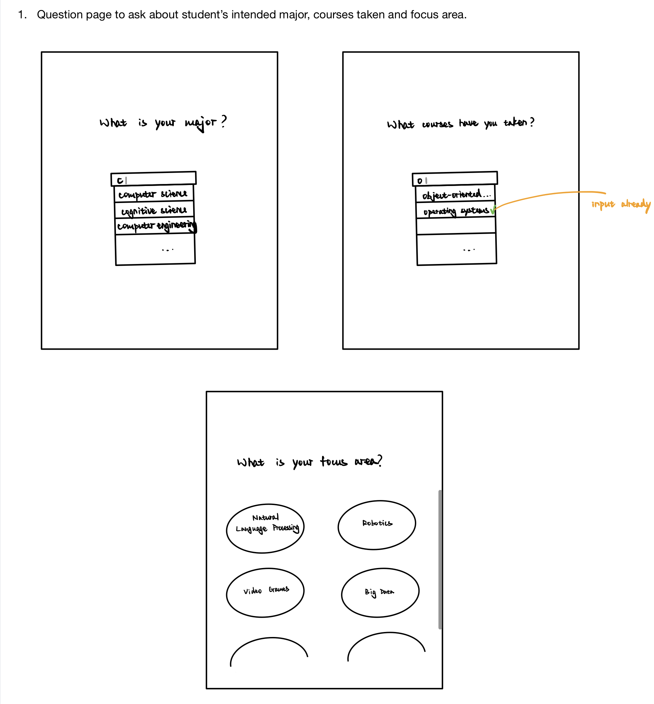
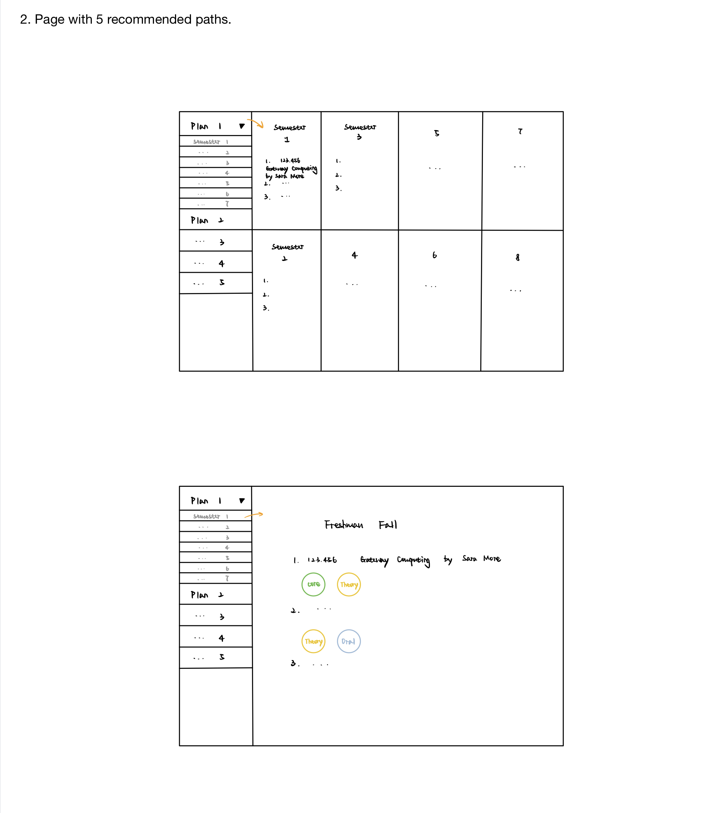

# OO Design

A UML class diagram reflecting the "model" for that iteration only.
Use a software to draw this (e.g. draw.io) and save the diagram as an image.
Upload the image and link it in here using this sintax.

# Wireframe

# Iteration Backlog

- As a student, I want to input my major and courses taken so that the application knows my current progress.
- As a student, I want to see a list of courses that I'm eligible for in the next semester so that I can choose between them.
- As a student, I want to determine the number of courses I want to take each semester so that I can evenly distribute remaining courses to each semester.
- As a student, I want to receive a schedule that doesn’t contain time conflicts, so that I can directly use it as my plan.
- As a student, I want to log in/out into this application, so that I can save my information.

# Tasks

- Establish a MongoDB database.
- Build a basic frontend with React.
- Build a server with Node.js that can communicate with frontend.
- Contact with the Registrar to obtain SIS api read permission.
- Setup tables in
