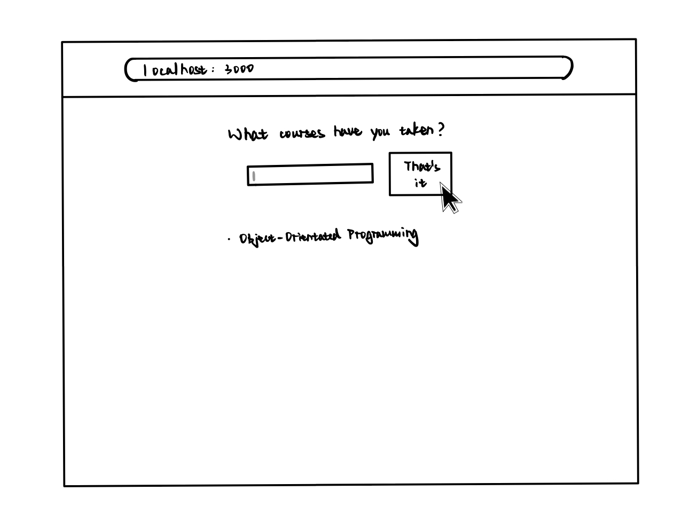
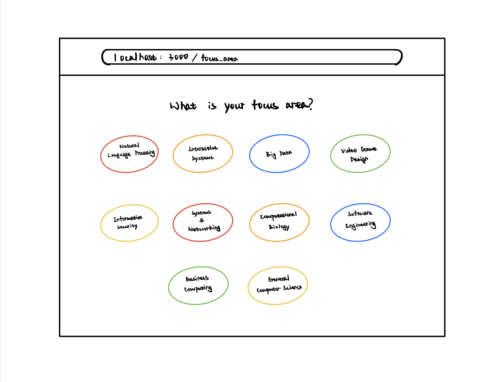
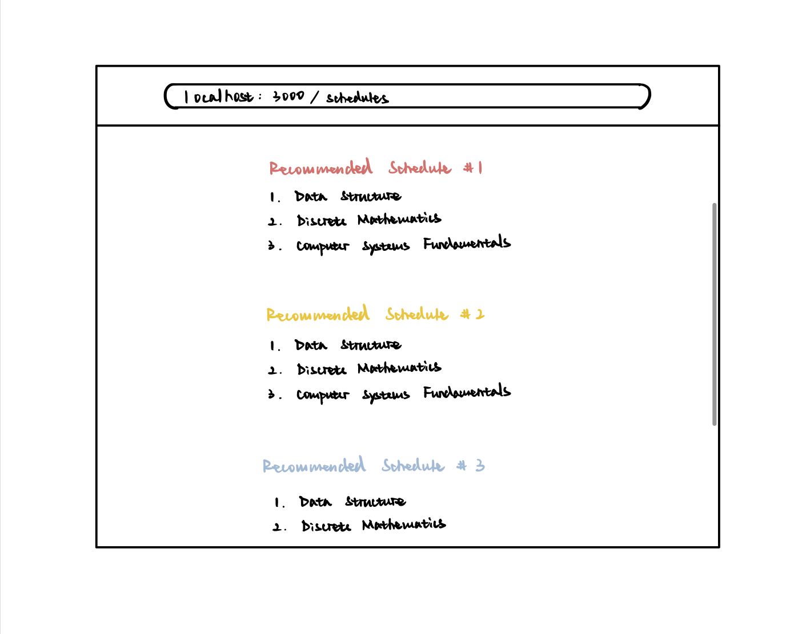

# Wireframe

On the first page, the user is asked to input the courses he/she has taken. 

Once all courses are added, the user clicks on "That's it", which would then redirect him/her to the following page. 

The user clicks on one of the focus areans and is then taken to the final recommendation page.   

## Iteration Backlog
- As a student, I want to input the courses I have taken so that the application knows my current progress.
- As a student, I want to see multiple recommended schedules so that I get the flexibility to choose between them. 
- As a student, I want to receive a schedule that doesn’t contain time conflicts, so that I can directly use it as my plan.

## Tasks
- Implement a simple version of course recommendation algorithm that outputs recommendations for next semester.
- Add interfaces that allow users to input the courses he/she has taken.
- Add all course infomation to database.
