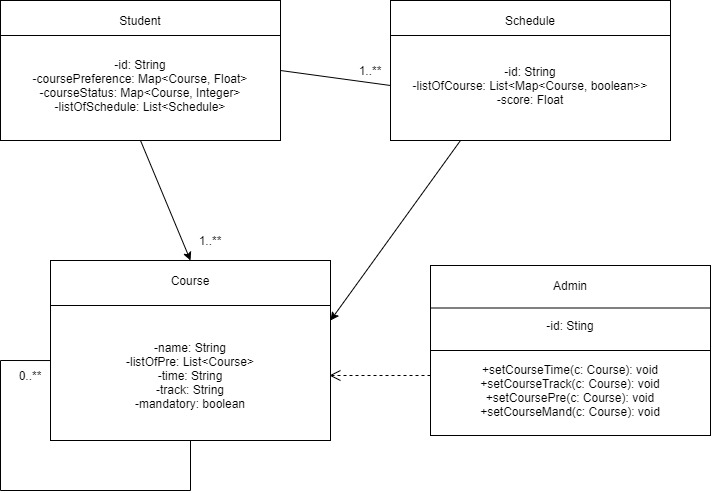
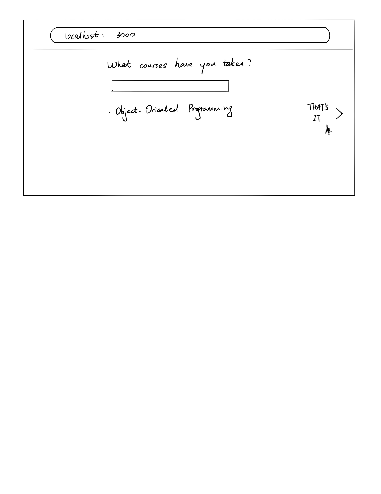
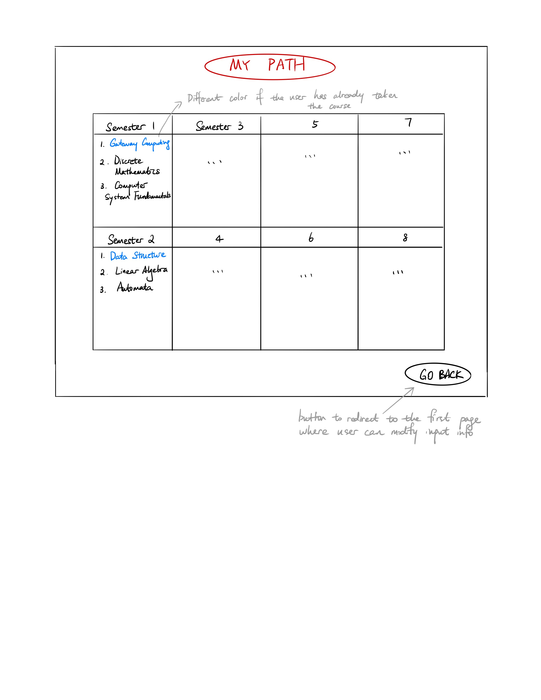

# OO Design

A UML class diagram reflecting the "model" for that iteration only.
Use a software to draw this (e.g. draw.io) and save the diagram as an image.
Upload the image and link it in here using this sintax.

# Wireframe
The first and second page will remain the same as Iteration 2, where the user is first asked to input the courses he/she has taken.

Once all courses are added, the user clicks on "That's it", which would then redirect him/her to the following page.

The user clicks on one of the focus areas and is then taken to the final recommendation page. The recommendation page shows a complete 4-year schedule with specific courses to take each semester.

## Iteration Backlog
- As a student, I want to determine the number of courses I want to take each semester so that I can evenly distribute remaining courses to each semester.
- As a student, I want to see multiple recommended schedules so that I get the flexibility to choose between them.
- As a student, I want to receive a full schedule that doesn’t contain time conflicts, so that I can directly use it as my plan.
- As a student, I want to receive a schedule that fits into the school’s spring/fall course offerings, so that the schedule is correct and practical.

## Tasks
- Implement a simple but full version of course recommendation algorithm(exclude recommendation based on preferences).
- Add a better interface for displaying course schedules.
- Add all course infomation to database.
