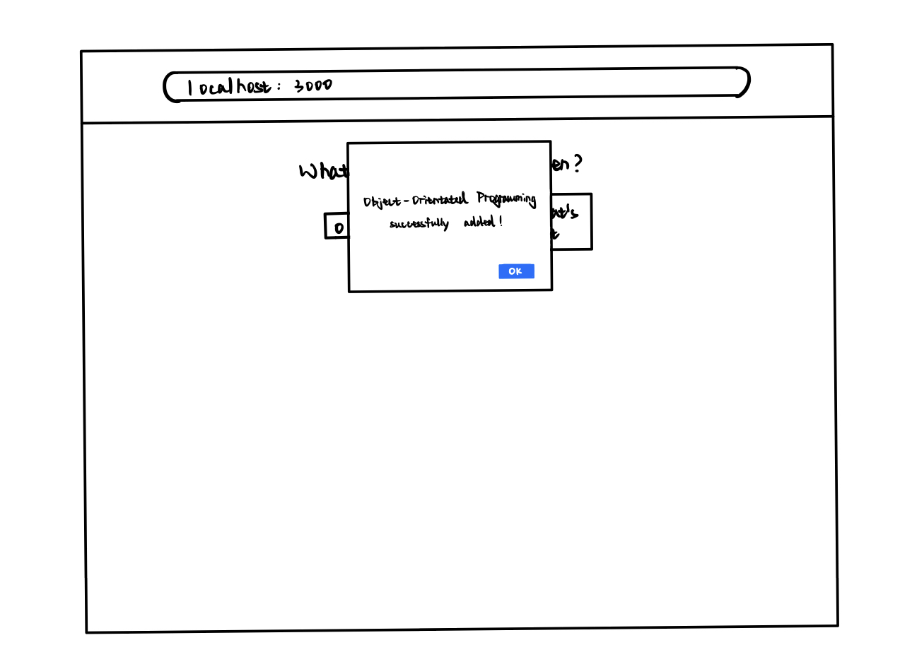
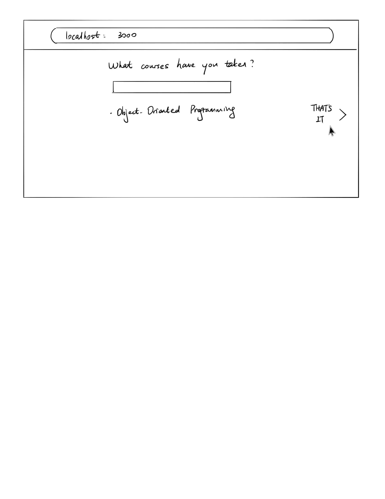
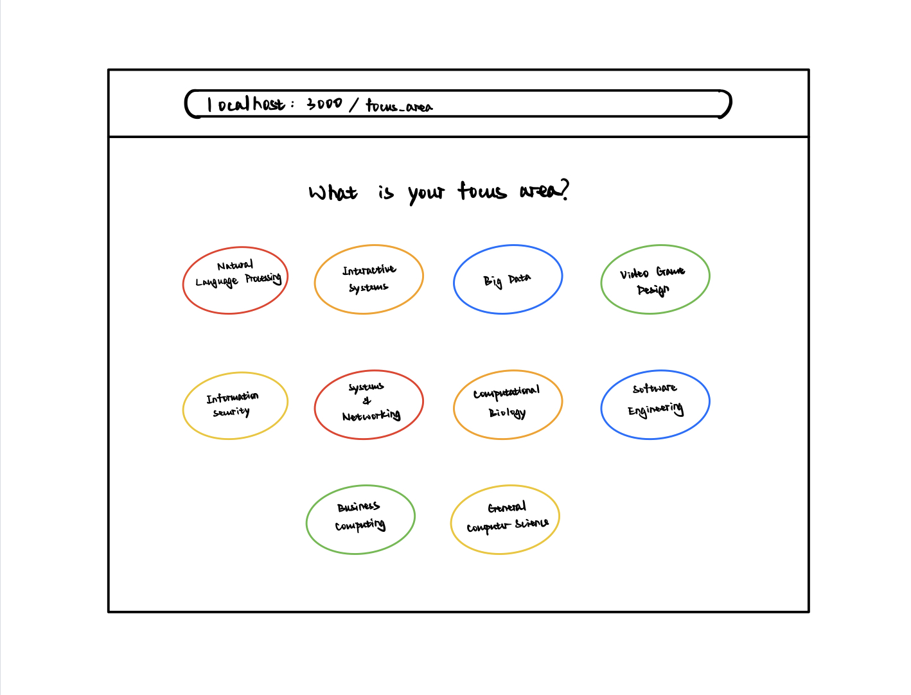
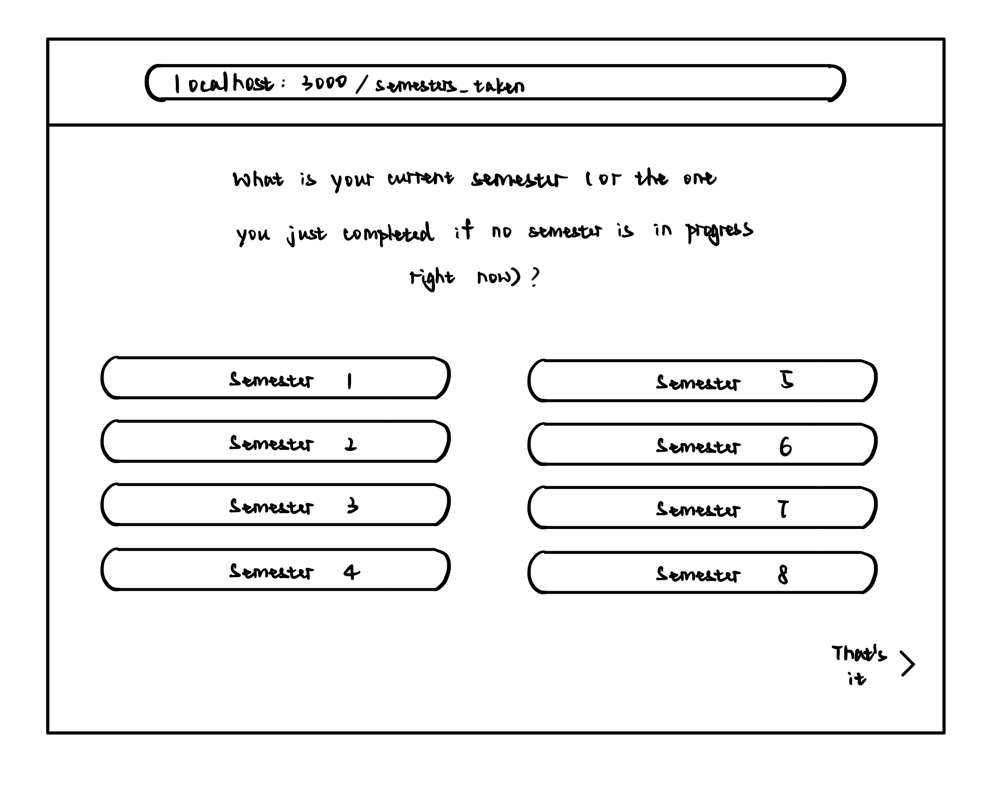
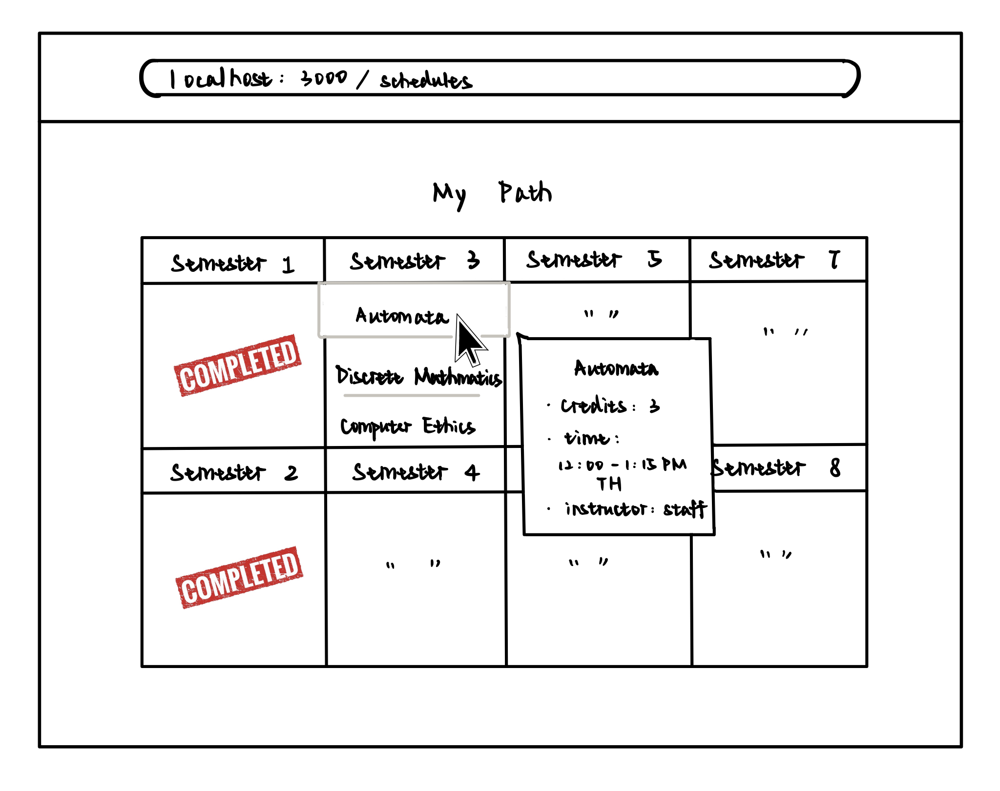
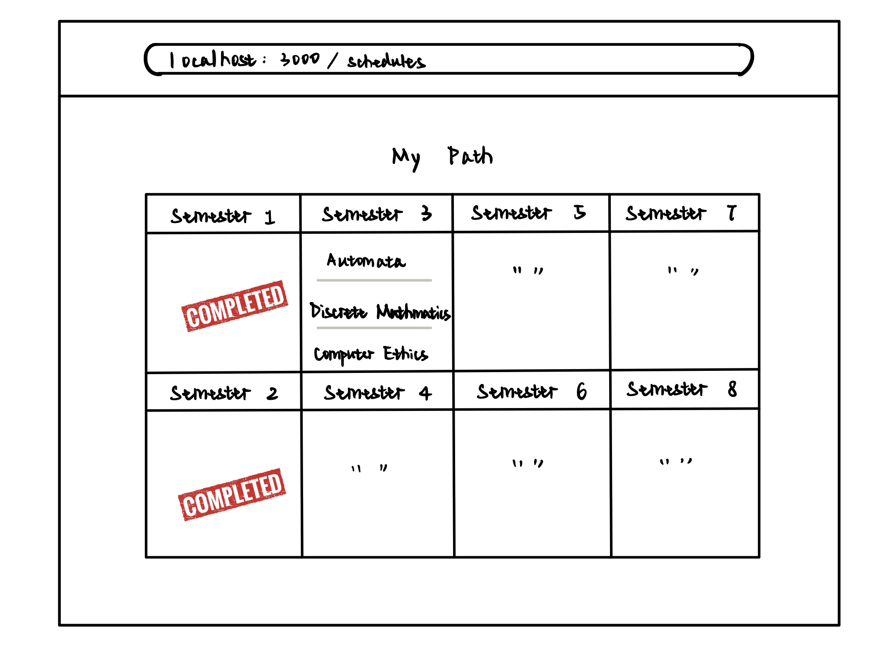

# OO Design

# Wireframe
The first and second page will remain the same as Iteration 2, where the user is first asked to input the courses he/she has taken.

Once all courses are added, the user clicks on "That's it", which would then redirect him/her to the following pages.

The user clicks on one of the focus areas and is then taken to the final recommendation page. The recommendation page shows a complete 4-year schedule with specific courses to take each semester.

User is given more details on a course once his/her cursor hovers on that course. In the event that there does NOT exist a schedule to allow the user to graduate in 4 years, the user is taken to the following page. 

## Iteration Backlog
- As a student , I want to make sure that I can successfully graduate by following the recommended course path.
- As a student, I want to know if I can graduate on time with a CS degree based on my current school year and the courses I have taken.
- As a student, I want to receive a schedule that fits into the school’s spring/fall course offerings, so that the schedule is correct and practical.
- As a student who has taken 1+ gap semesters, I want to receive a schedule that accomodates to my unique circumstances.
    (e.g. after a gap semester, I might start my sophomore year in the spring)
- As a student, I want to see an 8-semester overview of my academic progress(e.g. what has been completed, what is yet to be done) in the final recommended course path calendar view.

## Tasks
- Optimize code to eliminate redundencies.

