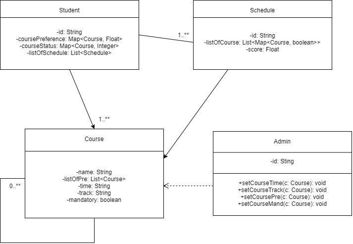

# OO Design

# Wireframe
The first and second page will remain the same as Iteration 2, where the user is first asked to input the courses he/she has taken.

Once all courses are added, the user clicks on "That's it", which would then redirect him/her to the following pages.

The user clicks on one of the focus areas and is then taken to the final recommendation page. The recommendation page shows a complete 4-year schedule with specific courses to take each semester.

User is given more details on a course once his/her cursor hovers on that course. In the event that there does NOT exist a schedule to allow the user to graduate in 4 years, the user is taken to the following page. 

## Iteration Backlog
- As a student , I want to see multiple recommended schedules so that I can choose one based on my personal preferences. 
- As a student, I want my schedule to contain more courses from my focus area so that I take the most value out of my time in college. 
- As a student, I want to view the application on different devices with the same level of comfort. 
- As a student, I would like to see the focus areas each of my recommended class belongs to, so that I get a better idea of what I will learn. 
- NICE TO HAVE: as a student, I want to input my preferred courses so that my schedule can fit my preferences better. 

## Tasks
- Front-end works towards responsive design. 
- Front-end adds in an additional question page and a divider section to navigate to different recommended schedules. 
- Back-end algorithm uses a weighting scheme to limit the computational complexity.

